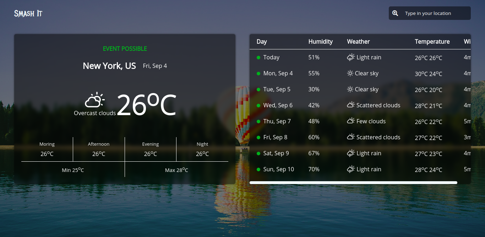

# Weather App



## Project setup

Install npm dependencies `npm i`
Create `.env` then visit [Open weather map API](https://openweathermap.org), create an account and paste your `api key` in the `.env` file👇

```
API_KEY=myApiKey
```

## Run the project

| Comand          | Action                                        |
| --------------- | --------------------------------------------- |
| `npm run build` | Build all the assets in `./src` to `./public` |
| `npm run watch` | Watch for changes in the `./src`              |
| `npm run serve` | Serve under http-server on localhoost:8080    |

---

> Set the dev environment to development in the `webpack.config.js`
